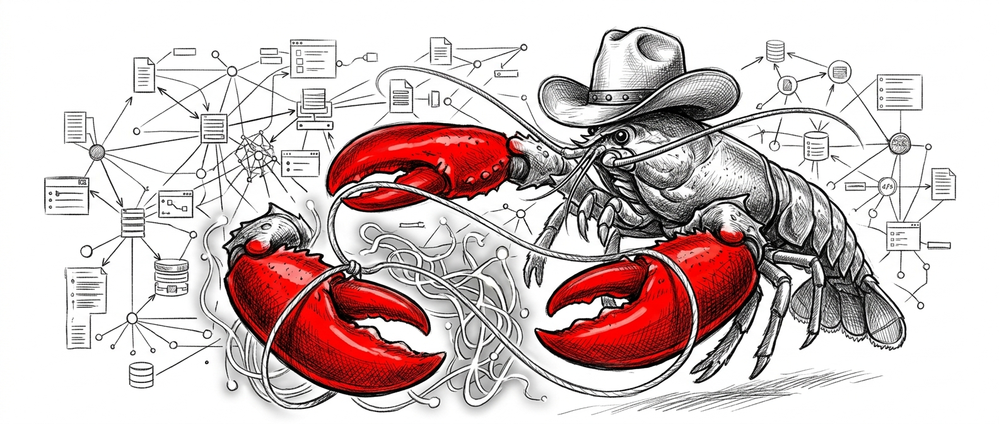

<p align="center">
  <picture>
    <source media="(prefers-color-scheme: dark)" srcset="openclaw-ontology-dark.png" />
    <source media="(prefers-color-scheme: light)" srcset="openclaw-ontology.png" />
    
  </picture>
</p>

## What is an Ontology?

AI agents are only as good as the world model they operate within.

When your agent reads an email, does it know that "Alice" is the same Alice assigned to the Q3 project — and that the commitment she just made in Slack is now blocking a deployment? Without an ontology, the answer is almost certainly no.

An ontology is a structured map of the things that matter in your domain: the entities (people, projects, contracts, tasks), the typed relationships between them, and the rules that govern how they behave. It's the difference between an agent that pattern-matches over raw text and one that actually understands your business.

This is the approach Palantir built at enterprise scale with Foundry and AIP — a living semantic layer where agents don't just read data, they operate within a structured representation of your reality. The result is agents that are auditable, composable, and safe to run in production.

This plugin brings that same principle to [OpenClaw](https://openclaw.com), the local-first personal AI agent framework. It bridges your data warehouse (starting with Databricks + Unity Catalog) to your agents through a YAML-defined business ontology — a curated layer of entities, relationships, metrics, and dimensions that agents reason over safely, with read-only guardrails, query validation, and automatic context injection.

**Stop giving your agents raw data. Give them a world they understand.**

## Overview

The ontology plugin bridges the gap between your data warehouse and OpenClaw's AI agents. Instead of giving agents raw database access, you define a business ontology -- a curated layer of entities, relationships, metrics, and dimensions -- that agents use to answer data questions safely and accurately.

```
User question                  Ontology plugin                  Data warehouse
"What was our revenue   --->   Resolves entities/metrics  --->  SELECT SUM(total_amount)
 by segment last quarter?"     Builds safe SQL                  FROM fact_orders e1
                               Joins tables automatically       JOIN dim_customers e2 ...
                               Enforces read-only               WHERE ...
                          <--- Formats markdown table      <--- [result rows]
```

## Features

- **YAML Ontology DSL** -- Define entities, relationships, metrics, and dimensions in human-readable YAML files
- **Databricks Connector** -- First-class support for Databricks SQL warehouses; extensible connector interface for Snowflake, BigQuery, Postgres, and others
- **6 Agent Tools** -- `ontology_query`, `ontology_explore`, `ontology_list`, `ontology_describe`, `ontology_sql`, `ontology_validate`
- **Automatic Context Injection** -- Ontology summaries are injected into agent system prompts so agents know what data is available before the user even asks
- **Ontology-Aware SQL Generation** -- The query planner resolves cross-entity joins, aliases tables, applies metric filters, generates correct GROUP BY clauses, and supports time granularities (`DATE_TRUNC`) automatically
- **Read-Only Safety Guardrails** -- DML/DDL rejection, row limits, query timeouts, and filter sanitization prevent destructive operations
- **CLI Management** -- List, describe, validate, sync, and scaffold ontologies from the command line
- **Keyword-Based Relevance** -- Only ontologies relevant to the user's question are injected into context, keeping token costs low

## Installation

### From source (development)

```bash
git clone https://github.com/openclaw/openclaw-ontology.git
cd openclaw-ontology
npm install
npm run build
openclaw plugins install "$(pwd)"
```

The plugin installs but won't activate until you configure a database connector (next step). You'll see a warning like `ontology failed during register: Error: ontology config required` -- this is expected.

### Configure the connector

You can find the **host** and **HTTP path** in the Databricks UI under **SQL Warehouses > (your warehouse) > Connection details**. The **catalog** is the top-level entry in the **Catalog** sidebar.

Set each value one at a time (the plugin will show registration warnings until all required fields are set -- this is normal):

```bash
# Store the token in OpenClaw's env config so the gateway can resolve it
openclaw config set env.DATABRICKS_TOKEN "dapi..."

openclaw config set plugins.entries.ontology.config.connector.host "dbc-xxxxx.cloud.databricks.com"
openclaw config set plugins.entries.ontology.config.connector.path "/sql/1.0/warehouses/abc123"
openclaw config set plugins.entries.ontology.config.connector.token '${DATABRICKS_TOKEN}'
openclaw config set plugins.entries.ontology.config.connector.catalog "workspace"
openclaw config set plugins.entries.ontology.config.connector.schema "default"
```

The token uses `${DATABRICKS_TOKEN}` syntax which references the env var set via `openclaw config set env.DATABRICKS_TOKEN`. This ensures the gateway process can resolve it at runtime (shell `export` alone is not enough since the gateway runs as a separate process).

Once all three required fields (`host`, `path`, `token`) are set, you should see `ontology: plugin registered` in the output.

### Allow the plugin and enable tools

The ontology plugin must be explicitly allowed. You also need the `full` tools profile -- the default `coding` profile filters out plugin-registered tools:

```bash
openclaw config set plugins.allow '["ontology"]'
openclaw config set tools.profile "full"
openclaw gateway restart
```

If you prefer to stay on the `coding` profile, you can switch back after confirming the ontology tools work and look for a per-tool allowlist in your OpenClaw version.

### Verify installation

```bash
openclaw plugins list
```

You should see `ontology` with status **loaded** in the output. If you still see a `plugins.allow is empty` warning, the allow step above didn't take -- re-run it.

### Reinstalling

If you need to reinstall (e.g. after updating the source), remove the existing install first:

```bash
rm -rf ~/.openclaw/extensions/ontology
openclaw plugins install "$(pwd)"
```

## Quick Start

### 2. Create an ontology

**Option A: Generate from your database (recommended)**

The `ontology discover` command inspects your live database schema, samples rows, and uses an LLM to generate a starter ontology YAML:

```bash
mkdir -p ~/.openclaw/ontologies
openclaw ontology discover \
  --catalog workspace \
  --schema default \
  --sample-rows 3 \
  --id my_ontology \
  --name "My Ontology" \
  --output ~/.openclaw/ontologies/my-data.yaml
```

You can filter which tables to include:

```bash
# Only fact tables
openclaw ontology discover --include 'fact_*' --output ontology.yaml

# Everything except staging tables
openclaw ontology discover --exclude '*_staging' --output ontology.yaml
```

The generated ontology includes dimensions for date/timestamp columns (with time granularities) and categorical string columns (e.g., `segment`, `status`, `country`). The output is a starting point -- review and edit the YAML before using it in production.

**Option B: Start from a blank template**

```bash
mkdir -p ~/.openclaw/ontologies
openclaw ontology init > ~/.openclaw/ontologies/my-data.yaml
```

Edit the YAML to match your actual tables, or use one of the [examples](examples/).

### 3. Validate

```bash
openclaw ontology validate
```

### 4. Query through an agent

Make sure the gateway is running (`openclaw gateway start`), then ask your OpenClaw agent a question. Start by discovering what's available:

> What data sources do you have access to? Explore the ontology and tell me what metrics and dimensions are available.

Then ask business questions:

> What are the top 5 countries by total revenue? Break it down by payment method.

> Show me total order amount by category for the last quarter.

> What was our total revenue by customer segment last quarter?

> Give me total order volume per month.

The agent automatically uses `ontology_list` and `ontology_explore` to discover available data, then `ontology_query` to plan the SQL, execute it safely, and return a formatted table.

### Dimension granularities

Time dimensions support granularity suffixes via `dimension_id:granularity` syntax. For example, if an ontology defines a `time` dimension on `order_date` with granularities `[day, week, month, quarter, year]`:

- `"time"` -- groups by raw `order_date`
- `"time:month"` -- generates `DATE_TRUNC('month', e1.order_date) AS order_date_month`
- `"time:quarter"` -- generates `DATE_TRUNC('quarter', e1.order_date) AS order_date_quarter`

The agent sees these options in tool descriptions and context injection, so it picks the right granularity without user guidance on syntax.

## How It Works

### Plugin Architecture

```
openclaw.plugin.json         Plugin manifest (config schema, UI hints)
index.ts                     Plugin entry -- registers tools, hooks, CLI, service
config.ts                    Config validation with env var resolution

src/ontology/                Ontology DSL core
  types.ts                   TypeScript types for YAML DSL
  loader.ts                  YAML parser + structural validator
  resolver.ts                Relationship graph builder + join path-finding (BFS)
  validator.ts               Live DB schema validation

src/connectors/              Database abstraction layer
  types.ts                   DatabaseConnector interface
  registry.ts                Connector factory registry
  databricks.ts              Databricks SQL implementation

src/query/                   Query engine
  planner.ts                 Ontology-aware SQL generation
  executor.ts                Query execution + result formatting
  safety.ts                  Read-only enforcement + filter sanitization

src/context/                 Agent integration
  injector.ts                Build <ontology-context> for system prompts
  selector.ts                Keyword-based relevance scoring

src/tools/                   Agent tools (6)
src/cli/                     CLI commands
src/service/                 Background connector lifecycle
```

### Agent Integration Flow

1. **Service start** -- Plugin connects to the database and loads all ontology YAML files from `ontologyDir`
2. **Before agent start** -- The `before_agent_start` hook runs keyword matching against the user's prompt, selects relevant ontologies, and injects a summary into the system prompt
3. **Agent reasoning** -- The agent sees the ontology context and chooses appropriate tools
4. **Query execution** -- `ontology_query` plans SQL from structured parameters, validates safety, applies limits, executes, and returns markdown
5. **Service stop** -- Connector is disconnected cleanly

## Documentation

| Document | Description |
|----------|-------------|
| [Getting Started](docs/getting-started.md) | Step-by-step tutorial from install to first query |
| [Ontology DSL Reference](docs/ontology-dsl.md) | Full YAML format specification with examples |
| [Connectors](docs/connectors.md) | Database setup, env vars, adding new connectors |
| [Agent Usage](docs/agent-usage.md) | How agents use tools, example conversations, tips |
| [Configuration](docs/configuration.md) | All config keys with types, defaults, and descriptions |
| [Architecture](docs/architecture.md) | Internal design, data flow, extension points |
| [Security](docs/security.md) | Safety model, query guardrails, threat mitigations |
| [Troubleshooting](docs/troubleshooting.md) | Common issues, diagnostics, FAQ |

## Examples

- [`examples/ecommerce.yaml`](examples/ecommerce.yaml) -- E-commerce: orders, customers, products with revenue/AOV/units metrics
- [`examples/saas-metrics.yaml`](examples/saas-metrics.yaml) -- SaaS: subscriptions, customers, usage events with MRR/churn/DAU metrics

## Requirements

- OpenClaw (latest)
- Node.js 22+
- A supported data warehouse (Databricks SQL currently; more connectors planned)

## License

Apache-2.0
